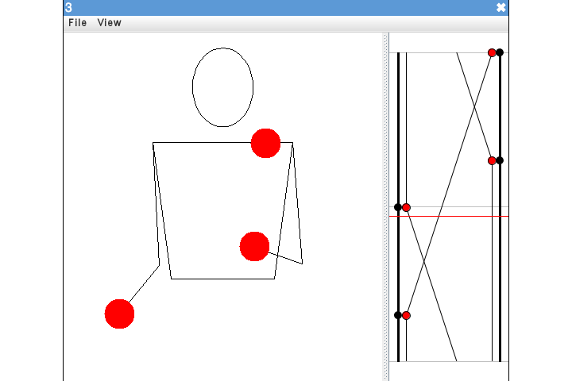

# jugglinglab-cheerpj

Run [Juggling Lab](https://jugglinglab.org/) in the browser using [CheerpJ](https://www.leaningtech.com/cheerpj/).

Demo: **[Try it here!](https://jugglinglab.karavia.ch)**

Based on Juggling Lab v1.2.1 and CheerpJ v1.4.

## License

This wrapper is licensed under the MIT license, see the LICENSE file.

Juggling Lab is licensed under the GNU GPL v2.0 license and is
[also available on GitHub](https://github.com/jkboyce/jugglinglab).
